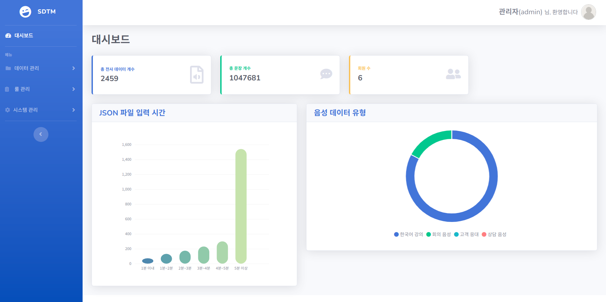

# SDTM (smart-data-tracing-management)
> AI 학습용 데이터 구축(2차) 사업 - 데이터 품질 관리 및 검증 플랫폼  

2020.10.05-2021.02.28

크라우드 소싱에 의해 전사된 한국어 강의/회의 음성/고객 응대/상담 음성 데이터를 관리하며, ETRI 전사규칙 기반으로 룰을 만들어 데이터 정보를 확인하고 전사규칙 준수 여부를 점검합니다.  
  
[SDTM 매뉴얼](https://docs.google.com/document/d/1EF0ysPyC-t6nF3UxD-LlGf-ztwdlsFJXvLM8UCWFMew/edit?usp=sharing)

## 사이트 접속
[http://45.32.55.180:8080/](http://45.32.55.180:8080/)

## 주요 기능

* Spring Security를 이용한 로그인, 로그아웃
* 사용자 등록 시 관리자에게 가입 승인 요청 메일 발송, 가입 승인시 사용자에게 알림 메일 발송
* 전사데이터 JSON 파일, 프로그램 Excel 파일, 음성 wav 파일 서버로 업로드
* 전사데이터를 워드, 엑셀, JSON 파일로 다운로드
* 전사 규칙 준수 여부 확인을 위한 데이터 검수 방식
  1. 메서드 : JavaCompiler를 이용해 페이지에서 자바 코드를 받아 실행
  2. SQL : 페이지에서 SQL 쿼리문을 받아 Statement를 이용해 쿼리문 실행
* 
  
## 시연 영상
  
  

